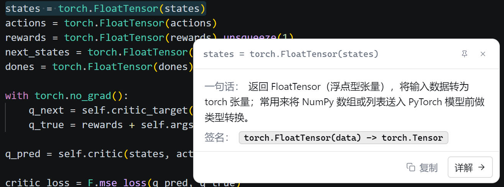
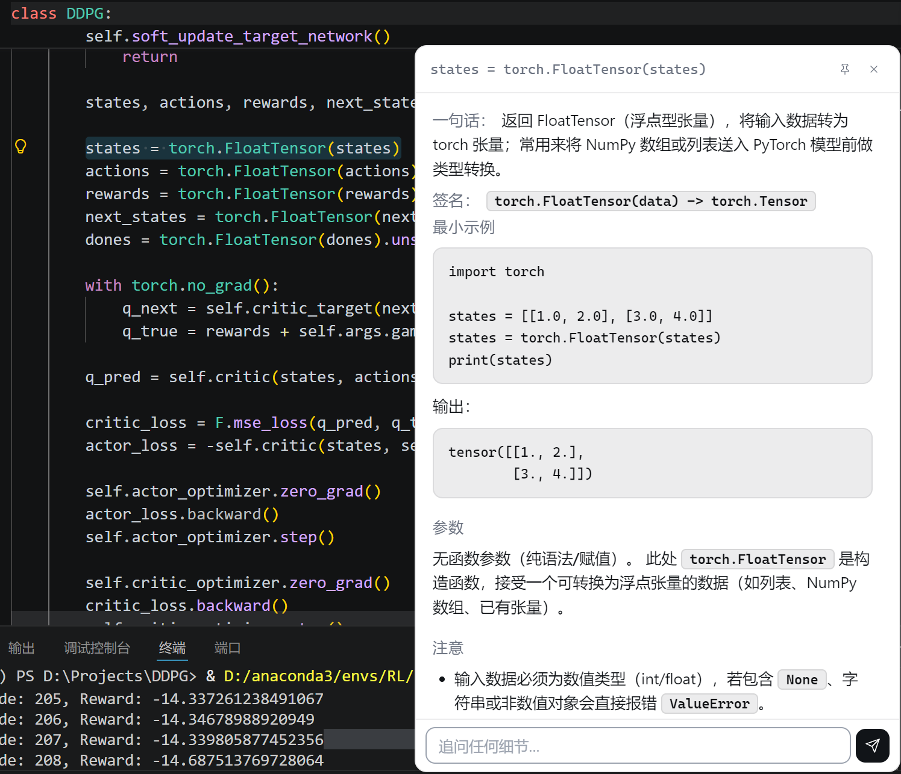
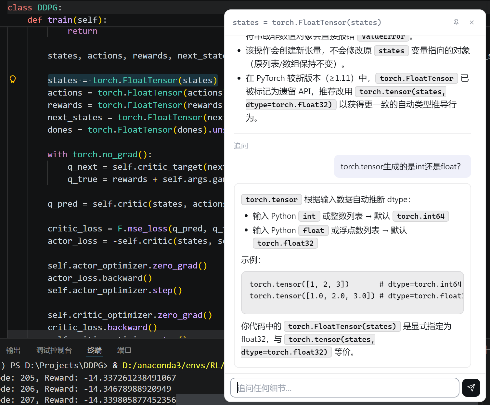

# WTF: What's This Function?

### 这是什 码？

> Ctrl C + 双击 Ctrl，即刻解读任意代码。
> 常驻系统托盘的桌面级代码解读小工具——选中代码，复制，双击 Ctrl，鼠标旁立刻弹出中文一句话速览与详解。


---

## 它是什么

**WTF** 是一个**桌面级**的代码解读小工具。在 VSCode、PyCharm、网页、PDF、终端——只要你能选中一段代码——就能：

1. `Ctrl+C` 复制
2. **双击 Ctrl**（300ms 内连按两次）
3. 鼠标旁弹出紧凑浮窗，**500ms 出首字**，1.2s 完整显示中文速览
4. 想深入则点「详解」——拆解 / 最小可运行示例 / 参数表 / 易错点
5. 直接在底部输入框追问，最多 10 轮对话

灵感来自有道词典的"双击 Ctrl 查词"，但服务的是程序员——速览不止"是什么"，还会给**函数签名**（含可选参数和默认值）；详解给的是**程序员真正需要的东西**：可复制粘贴运行的示例、参数表、非显然的坑。

## 截图

### 双击 Ctrl ——一秒拿到「是什么」和「函数签名」

<p align="center">
  
</p>

> 在 VSCode / 任意编辑器中选中代码 → `Ctrl+C` → 双击 `Ctrl`。鼠标旁约 500ms 出首字。
> **一句话**说明它"是什么 / 做什么"；**签名**给出完整参数列表、可选参数的默认值、返回类型。

### 「详解」展开 ——拿到最小示例 + 参数表 + 易错点

<p align="center">
  
</p>

> 点击「详解」窗口长高，显示**可复制粘贴运行**的最小示例 + 真实输出 + 参数表 + 非显然的坑。

### 「追问」对话 ——基于当前代码持续提问

<p align="center">
  
</p>

> 底部输入框 Enter 发送，AI 流式回复，最多 10 轮对话。所有上下文都带着当前代码。

---

## 特性

- ⌨️ **真·全局双击 Ctrl**：基于 `uiohook-napi` 的全局键盘钩子，任意应用中通用；安装失败时自动降级到 `Ctrl+Shift+K`
- ⚡ **流式输出 + 推理模式可关**：DeepSeek V4 默认开思考，但代码解读用不上——自动关掉，**首字延迟从 ~1800ms 降到 ~500ms**
- 🧠 **程序员视角的 Prompt**：速览 = 是什么+用途+完整签名；详解 = 最小示例 + 参数表 + 易错点；杜绝"用来处理…"这种抽象动词
- 🎨 **Linear / Vercel 极简 UI**：灰阶为主、单一冷色 accent、SVG 线条图标、Inter 字体、柔光阴影
- 📏 **自适应高度 + 可拖宽度**：内容自然贴合窗口；详解中拖高度则成为上限（超出滚动）
- 📌 **可固定窗口**：图钉切换两态——黑色线条 / 红色实心
- 💬 **流式追问**：基于当前代码上下文持续对话，最多 10 轮
- 🚀 **LRU 缓存**：100 条容量，重复代码秒级命中
- 🔧 **多 Provider**：支持 OpenAI 兼容（DeepSeek / 通义 / Moonshot）；Ollama / Claude 待补
- 🛡 **本地保存**：API Key、配置全部在本机 `electron-store`，不上传任何遥测

---

## 快速开始

### 用户：从安装包

1. 从 [Releases](https://github.com/MikeMengTR/whats-this-function/releases) 下载对应平台安装包
   - Windows: `WTF-Setup-x.y.z-x64.exe`
   - macOS: `WTF-x.y.z-arm64.dmg`（或 x64）
   - Linux: `WTF-x.y.z-x86_64.AppImage`
2. 安装并启动
3. 首次启动会提示**未配置 API Key**——打开配置文件填上 DeepSeek（或兼容接口）的 key：

   - Windows: `%APPDATA%\wtf\config.json`
   - macOS:   `~/Library/Application Support/wtf/config.json`
   - Linux:   `~/.config/wtf/config.json`

   ```json
   {
     "provider": "openai-compat",
     "apiKey": "sk-你的密钥",
     "baseUrl": "https://api.deepseek.com",
     "model": "deepseek-v4-flash",
     "thinking": "disabled"
   }
   ```

4. 完成。任意编辑器选中代码 → `Ctrl+C` → **双击 Ctrl** → 弹窗解读。

### 开发者：从源码

```bash
git clone https://github.com/MikeMengTR/whats-this-function.git
cd wtf
npm install
npm start
```

需要 Node ≥ 18（推荐 22）。Windows 上 `uiohook-napi` 走预编译二进制，无需 node-gyp 环境。

---

## 配置详解

完整字段（位于 `config.json`）：

| 字段 | 默认值 | 说明 |
|---|---|---|
| `provider` | `"openai-compat"` | LLM 提供商；目前只支持 OpenAI 兼容接口 |
| `apiKey` | `""` | API 密钥（必填） |
| `baseUrl` | `"https://api.deepseek.com"` | 接口域名（不含 `/v1`；OpenAI 用 `https://api.openai.com/v1`） |
| `model` | `"deepseek-v4-flash"` | 模型名 |
| `thinking` | `"disabled"` | DeepSeek 思考模式：`disabled` / `enabled` / `auto`（非 DeepSeek 用 auto） |
| `doubleTapThreshold` | `300` | 双击 Ctrl 的最大间隔（毫秒） |
| `autoCopy` | `false` | 是否自动模拟 Ctrl+C（P1，未实现） |
| `explainLanguage` | `"简体中文"` | 解释输出语言 |
| `difficulty` | `"beginner"` | 解释难度等级（暂未启用） |
| `autoLaunch` | `false` | 开机自启（暂未实现） |

### 环境变量覆盖

部署到团队或多账号场景时，环境变量优先于配置文件：

```bash
DEEPSEEK_API_KEY=sk-xxx
OPENAI_API_KEY=sk-xxx
CODEWHISPER_API_KEY=sk-xxx       # 三者择一
CODEWHISPER_BASE_URL=https://...
CODEWHISPER_MODEL=deepseek-v4-flash
```

### 关于 DeepSeek 的思考模式

DeepSeek V4 系列（`deepseek-v4-flash`、`deepseek-v4-pro`）**默认开启思考**，会在隐藏的 `reasoning_content` 上消耗 100~200 token——对"快速代码解读"这种简单任务**纯浪费**：首字延迟从 ~500ms 涨到 ~1800ms，账单也变多。

本项目默认 `"thinking": "disabled"`。实测对比（同一段 Python 函数）：

| 模式 | 首字延迟 | 完成耗时 | reasoning 字符 |
|---|---|---|---|
| 思考开启 | 1841ms | 2104ms | 144 |
| **思考关闭** | **522ms** | **1146ms** | 0 |

如果用其他 OpenAI 兼容接口（OpenAI、Moonshot、通义），改 `"thinking": "auto"` 即不附加该字段。

---

## 使用流程

### 主流程

1. **托盘图标**：启动后在系统托盘出现蓝色 `</>` 圆形图标，**右键** = 暂停/启用/退出
2. **选中代码 → `Ctrl+C` → 双击 `Ctrl`**：300ms 内连按两次
3. **浮窗弹出**：鼠标右下方约 12px 处，宽度 400 默认；流式显示一句话 + 签名
4. **点「详解」**：窗口自动长高，显示 Markdown 渲染的拆解 + 示例 + 参数表 + 注意
5. **底部输入框追问**：按 Enter 发送，AI 流式回复，最多 10 轮

### 浮窗交互

| 操作 | 行为 |
|---|---|
| 点击窗口外 / 按 `Esc` | 关闭浮窗 |
| 点击 📌 | 固定（不再因失焦消失），图标变红色实心 |
| 点击 ✕ | 关闭浮窗 |
| 拖动顶部标题栏 | 移动窗口 |
| 拖动窗口边/角 | 调整宽度（高度由内容自适应） |
| 详解中拖动高度 | 把当前高度设为天花板，超出滚动 |
| 输入框 Enter | 发送追问 |

### 键盘监听模式

启动日志会显示哪种模式：

- `uiohook` ✅ —— 原生模块加载成功，**双击 Ctrl** 生效（推荐）
- `fallback` ⚠️ —— 原生模块加载失败，降级为 `Ctrl+Shift+K`
- `none` ❌ —— 都失败，仅可从托盘菜单手动触发

绝大多数 Windows / macOS / Linux 环境下都能用 prebuilt 二进制成功加载 uiohook。

---

## 架构

```
┌──────────────── Electron Main Process ────────────────┐
│                                                       │
│   Tray Manager    Key Listener       Window Manager   │
│   (托盘 + 菜单)   (uiohook 双击 Ctrl) (浮窗位置+尺寸) │
│                         │                             │
│                         ▼                             │
│           Code Acquisition Layer                      │
│           (剪贴板读取，未来可加 Ctrl+C 模拟)           │
│                         │                             │
│                         ▼                             │
│           Language Detector → LLM Service             │
│                              ├─ OpenAI / DeepSeek     │
│                              ├─ Ollama (TODO)         │
│                              └─ Claude  (TODO)        │
│                              + LRU Cache (100)        │
│                                                       │
│   Config Store (electron-store)                       │
│                                                       │
│   IPC：contextBridge → window.whisper.*               │
├───────────────────────────────────────────────────────┤
│                Renderer Process                       │
│   popup/  index.html + styles.css + popup.js          │
│   QuickView · DetailView · ChatView · Toast           │
│   marked.umd.js（构建时拷贝自 node_modules）          │
└───────────────────────────────────────────────────────┘
```

源码目录：

```
src/
├── main/
│   ├── index.ts              # 入口
│   ├── tray.ts               # 系统托盘
│   ├── windowManager.ts      # 浮窗创建/定位/auto-fit/OS resize 监听
│   ├── keyListener.ts        # 双击 Ctrl 检测（uiohook 优先 / globalShortcut 降级）
│   ├── codeAcquisition.ts    # 从剪贴板取代码
│   ├── languageDetector.ts   # 关键词检测编程语言
│   ├── prompts.ts            # 速览/详解/追问 prompt 模板
│   ├── cache.ts              # LRU 缓存
│   ├── store.ts              # electron-store 配置
│   └── llm/
│       ├── openaiProvider.ts # OpenAI 兼容接口（+ DeepSeek thinking 字段）
│       └── llmService.ts     # Provider 工厂 + 高层 API
├── preload/preload.ts        # contextBridge 暴露 window.whisper
└── renderer/popup/
    ├── index.html
    ├── styles.css
    ├── popup.js              # 状态机、流式渲染、自适应高度
    └── lib/marked.umd.js     # 构建时拷贝
```

---

## 开发命令

```bash
# 开发
npm install
npm run build       # tsc + 拷贝渲染进程依赖
npm start           # build + 启动 Electron

# 调试脚本
node scripts/smoke-llm.mjs       # 单次连通性测试
node scripts/smoke-explain.mjs   # 速览 + 详解输出抽样
node scripts/smoke-stream.mjs    # 流式 + reasoning token 用量分析
node scripts/smoke-thinking.mjs  # 思考开/关速度对比
node scripts/smoke-prompts-v2.mjs # 9 个用例的速览输出回归

# 打包发布
npm run icon        # 重新生成 assets/icon.ico
npm run pack        # 仅打 dir 包不签名（快速验证）
npm run dist:win    # 出 NSIS 安装包到 release/
npm run dist:mac    # 出 dmg
npm run dist:linux  # 出 AppImage
```

### Windows 打包前置条件（重要）

`electron-builder` 在 Windows 上打包时会下载 `winCodeSign` 工具包，**包内含 Mac 的两个 dylib 软链接**。Windows 普通用户**没权限创建 symlink**，会导致 7za 返回 exit code 2，整个打包流程失败：

```
ERROR: Cannot create symbolic link : 客户端没有所需的特权 :
  ...\winCodeSign\...\darwin\10.12\lib\libcrypto.dylib
```

**解决（任选其一）**：

1. **开启 Windows 开发者模式（推荐，一次性 5 秒）**
   `设置` → `系统` → `开发者选项` → 打开"**开发人员模式**"。
   开启后无需管理员权限就可以创建符号链接。
2. 用管理员身份打开 PowerShell，再 `npm run dist:win`
3. 用 WSL 或在 Linux/macOS 上交叉打包 Windows 版本

`pack` 模式 (`--dir`) 也需要这一步（同样依赖 `winCodeSign` 里的 `rcedit.exe`）。

打包成功后产物在 `release/` 目录，Windows 端是 `release\WTF-Setup-x.y.z-x64.exe`。

---

## 性能基准

| 阶段 | 首字 | 完成 |
|---|---|---|
| 速览（v4-flash，思考关，流式） | ~500ms | ~1150ms |
| 详解（同上，~1200 字 Markdown） | ~500ms | ~3000ms |
| 缓存命中 | <50ms | <50ms |

测试环境：Windows 11，Node 22，DeepSeek `deepseek-v4-flash`（思考关闭）。

---

## Roadmap

P0（已完成）
- [x] 全局双击 Ctrl 监听 + 降级方案
- [x] OpenAI 兼容接口
- [x] 速览 / 详解 / 追问三套 prompt
- [x] 浮窗 UI + Markdown 渲染 + 流式输出
- [x] LRU 缓存
- [x] 自适应高度 + 用户可调宽度
- [x] DeepSeek 思考模式开关

P1（待补）
- [ ] 设置窗口 UI（替代手编 config.json）
- [ ] 自动 `Ctrl+C` + 剪贴板保护
- [ ] Ollama / Claude Provider
- [ ] 开机自启动
- [ ] 主题跟随系统（明/暗手动切换）

P2
- [ ] 历史记录面板
- [ ] 自定义触发键
- [ ] 代码片段收藏

---

## FAQ

**Q：双击 Ctrl 没反应？**
A：① 看启动日志键盘监听模式，若为 `none` 是 uiohook 没装上 / 权限不够；② macOS 需要在「系统设置 → 隐私 → 辅助功能」给本应用授权；③ 间隔太长（>300ms）会被当作两次单按。

**Q：弹窗弹出但显示 401/402？**
A：401 = key 写错或失效；402 = DeepSeek 账户余额不足，去 platform.deepseek.com 充值。

**Q：速览返回空 / `finish_reason=length`？**
A：你用的可能是推理模型且 `thinking` 没关。改 `"thinking": "disabled"`。

**Q：能换成 OpenAI 官方接口吗？**
A：能。`baseUrl: "https://api.openai.com/v1"`、`model: "gpt-4o-mini"` 之类、`thinking: "auto"`。

**Q：会上传我的代码到哪里？**
A：只发给你配置的 `baseUrl`。除此之外不上传任何遥测。API Key 仅本机存储。

**Q：复制了别的内容（比如一段不是代码的中文）也会触发吗？**
A：会，因为本工具只判断"剪贴板里是不是文本"。如果触发了非代码内容，可以直接按 `Esc` 关闭。

---

## 贡献

欢迎 Issue / PR。

提交 PR 前请：
1. `npm run build` 全通过（TypeScript 无报错）
2. 用 `node scripts/smoke-prompts-v2.mjs` 验证 prompt 改动不影响主流程
3. 描述测试场景

---

## License

[MIT](./LICENSE) © 2026 WTF Contributors

---

## 致谢

- [uiohook-napi](https://github.com/SnosMe/uiohook-napi) — 跨平台全局键盘钩子
- [marked](https://marked.js.org) — 极简 Markdown 渲染
- [electron-store](https://github.com/sindresorhus/electron-store) — 本地配置持久化
- [DeepSeek](https://www.deepseek.com) — 性价比之王的 LLM 服务
- 灵感来自有道词典的双击 Ctrl 查词
